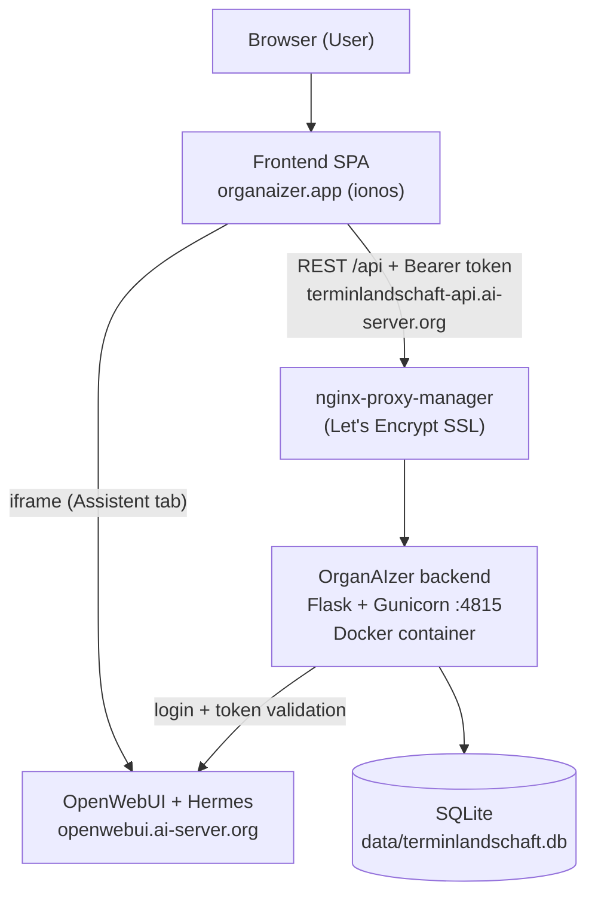

# OrganAIzer

> **OrganAIzer** is an AI-powered team workspace. It bundles an AI assistant,
> team scheduling, recurring task automation and voice features behind a single,
> authenticated web interface.
>
> The scheduling module started life as **Terminlandschaft** ("Appointment
> Landscape") — a full-stack meeting scheduling and visualization system — which
> is now the **Termine** area inside OrganAIzer. The repository and the internal
> backend are therefore still named `Terminlandschaft`.

---

## 1. Project Idea & Vision

OrganAIzer is meant to become the single place where a team gets its daily work
done with AI support. The UI is organized into four main categories, selectable
from the left sidebar:

| # | Category | Status | Purpose |
|---|----------|--------|---------|
| 1 | 🤖 **Assistent** | live (MVP) | Chat with **Hermes** (the AI assistant with skills), embedded via OpenWebUI. Supports file upload and download of generated images, audio and video. |
| 2 | 📅 **Termine** | live | The weekly meeting/appointment overview (the original Terminlandschaft). Import/export via Excel. |
| 3 | ✅ **Aufgaben** | placeholder | Recurring tasks stored as templates/workflows — likely implemented as Hermes skills. |
| 4 | 🎙️ **Sprache** | placeholder | Telephony, dictation (speech-to-text) and reading aloud (text-to-speech). |

The **Termine** module remains a complete, standalone product on its own: it
imports complex meeting schedules from Excel into a relational database and
visualizes them in a weekly calendar with filtering and highlighting.

---

## 2. Feature Overview

### Assistent (Hermes)
- Embedded OpenWebUI chat (Hermes is wired into OpenWebUI on the server).
- File upload into the chat; download of generated media (images/audio/video).
- Configurable target via `VITE_ASSISTANT_URL`.

### Termine (scheduling)
- **Excel import/export** with full round-trip fidelity (multi-sheet workbook).
- **Weekly calendar** (Mon–Sun columns, 7:00–19:00 timeline).
- **Appointment details modal** (double-click) with participants and metadata.
- **Filtering** by department (Bereich A–F) or specific meeting number.
- **Highlight mode** (dim non-matching vs. hide).
- **Week navigation** across a 4-week rotation.

The sample dataset models: **6 department groups**, **116 user groups**,
**243 meeting definitions** and **243 scheduled instances**.

### Authentication
- Login is required for the whole app.
- Accounts are managed in **OpenWebUI**; OrganAIzer authenticates against it
  (no separate user database, no Keycloak required).

---

## 3. Architecture

OrganAIzer is deployed across **two hosts**: the frontend is statically hosted
at ionos, the backend runs as a Docker container on the AI server and is exposed
via HTTPS through the server's nginx-proxy-manager.



Key points:

- **Frontend** (React/TypeScript/Vite) is a static SPA. In production it calls
  the backend at an absolute HTTPS URL (`VITE_API_BASE`).
- **Backend** (Flask, served by Gunicorn) also bundles a copy of the built
  frontend, so the container is a fully working app on its own at
  `:4815` / the backend subdomain.
- **HTTPS reverse proxy**: `terminlandschaft-api.ai-server.org` (backend) and
  `openwebui.ai-server.org` (assistant) are proxied by nginx-proxy-manager with
  Let's Encrypt certificates. DNS is a wildcard `*.ai-server.org` → the server.
- **Auth**: OpenWebUI is the identity backend. The frontend sends credentials to
  `/api/auth/login`, the backend forwards them to OpenWebUI, and validates the
  returned token on every protected request (with short-lived caching).
- **Database**: SQLite by default, behind an abstract `DatabaseInterface` (a
  PostgreSQL adapter can be added). Database and config live **on the host** and
  are mounted into the container.

### Production Environment

| Component | URL / Location | Notes |
|-----------|----------------|-------|
| Frontend | `https://organaizer.app` | ionos static hosting; no-cache `.htaccess` for `index.html` |
| Backend API | `https://terminlandschaft-api.ai-server.org` | nginx-proxy-manager → container `:4815` |
| Backend container | `167.235.156.114`, `/root/OrganAIzer/`, port `4815` | Docker (`OrganAIzer`), compose project `terminlandschaft` |
| Assistant | `https://openwebui.ai-server.org` | OpenWebUI + Hermes (shared server service) |

---

## 4. Technology Stack

| Layer | Technology |
|-------|------------|
| **Backend** | Python 3.12, Flask, Flask-CORS, Gunicorn |
| **Database** | SQLite3 (abstract interface, PostgreSQL-ready) |
| **Excel** | openpyxl |
| **Frontend** | React 18, TypeScript, Vite |
| **Styling** | Plain CSS (custom design system) |
| **Auth** | OpenWebUI accounts (token-based) |
| **Assistant** | OpenWebUI + Hermes (embedded) |
| **Packaging** | Docker (multi-stage), docker compose |
| **Reverse proxy** | nginx-proxy-manager + Let's Encrypt |

---

## 5. Repository Structure

```
Terminlandschaft/                # repo root (project = OrganAIzer)
├── schedule.xlsx                # Source Excel data (sample dataset)
├── requirements.txt             # Python dependencies
├── requirements.md              # Requirements spec
├── implementation.md            # Implementation notes
├── README.md                    # This file
├── .env.example                 # Configuration template (copy to .env)
├── .dockerignore
├── start.sh                     # Local all-in-one startup
├── Dockerfile                   # Multi-stage build (frontend + backend)
├── docker-compose.yml           # Container orchestration (project: terminlandschaft)
├── docker-entrypoint.sh         # Container entry (first-run import + serve)
├── upload_backend.sh            # Deploy backend → AI server + docker compose up
├── upload_frontend.sh           # Deploy frontend → ionos
├── update_all.sh                # Deploy backend + frontend together
├── backend/
│   ├── main.py                  # CLI entry point (import/export)
│   ├── server.py                # Flask app factory (API + static SPA, CORS)
│   ├── config.py                # Env-driven configuration
│   ├── auth.py                  # OpenWebUI-based authentication
│   ├── db/
│   │   ├── interface.py         # Abstract DB interface (ABC)
│   │   ├── sqlite_adapter.py    # SQLite implementation
│   │   └── models.py            # Table definitions
│   ├── services/
│   │   ├── import_service.py    # Excel → DB
│   │   └── export_service.py    # DB → Excel
│   └── api/
│       └── routes.py            # REST API + auth routes + auth guard
├── frontend/
│   ├── package.json
│   ├── vite.config.ts
│   ├── .env.production          # Prod build vars (VITE_API_BASE, VITE_ASSISTANT_URL)
│   ├── public/
│   │   └── .htaccess            # ionos: no-cache index.html + SPA routing
│   └── src/
│       ├── App.tsx              # Shell: auth gate + category routing
│       ├── main.tsx             # Entry point
│       ├── api.ts               # API client (auth token handling)
│       ├── types.ts             # TypeScript interfaces
│       ├── vite-env.d.ts        # Vite env typings
│       ├── styles/
│       │   ├── calendar.css     # Termine/calendar styles
│       │   └── app.css          # Shell, sidebar, login, placeholders
│       └── components/
│           ├── Sidebar.tsx          # Category navigation + user/logout
│           ├── LoginScreen.tsx      # OpenWebUI login form
│           ├── AssistentView.tsx    # Hermes/OpenWebUI iframe
│           ├── TermineView.tsx      # Scheduling module (state + layout)
│           ├── PlaceholderView.tsx  # Aufgaben & Sprache placeholders
│           ├── WeeklyCalendar.tsx   # Calendar grid
│           ├── WeekSelector.tsx     # Week navigation
│           ├── FilterPanel.tsx      # Filter/highlight controls
│           ├── AppointmentDetail.tsx# Detail modal
│           └── ImportExport.tsx     # Import/export buttons
└── data/
    └── terminlandschaft.db      # SQLite database (gitignored, host-mounted)
```

---

## 6. Configuration

All backend configuration lives in a `.env` file in the project root. Copy the
template and adjust as needed:

```bash
cp .env.example .env
```

| Variable | Default | Description |
|----------|---------|-------------|
| `WEB_PORT` | `4815` | Port the backend listens on |
| `WEB_HOST` | `0.0.0.0` | Bind host/interface |
| `FLASK_DEBUG` | `false` | Flask debug mode (keep `false` in production) |
| `CORS_ORIGINS` | see `.env.example` | Allowed frontend origins (comma-separated, or `*`) |
| `AUTH_ENABLED` | `true` | Require login on all `/api` routes |
| `OPENWEBUI_URL` | `https://openwebui.ai-server.org` | Identity backend used for login/token validation |
| `DB_PATH` | `data/terminlandschaft.db` | SQLite path (relative to root or absolute) |
| `LOG_LEVEL` | `DEBUG` | Logging level |
| `LOG_FILE` | `log.txt` | Log file path |

> `.env` is gitignored. Never commit real secrets — use `.env.example` as the
> tracked template.

### Frontend build-time variables

The frontend reads these at **build time** (Vite). Production values live in
`frontend/.env.production`:

| Variable | Purpose | Production value |
|----------|---------|------------------|
| `VITE_API_BASE` | Backend API base URL | `https://terminlandschaft-api.ai-server.org/api` |
| `VITE_ASSISTANT_URL` | Embedded assistant (OpenWebUI) | `https://openwebui.ai-server.org/` |

If `VITE_API_BASE` is unset, the frontend falls back to the relative `/api`
(used when the SPA is served directly by the Flask backend, same-origin).

---

## 7. Local Development

Prerequisites: **Python 3.12+**, **Node.js 20+**, **npm 9+**.

### Quick start (all-in-one)

```bash
./start.sh
```

This installs dependencies, imports the sample data, builds the frontend and
starts the server on `WEB_PORT` (default `4815`). Open http://localhost:4815.

> For local development you may want to set `AUTH_ENABLED=false` in `.env` so you
> don't need OpenWebUI credentials.

### Manual backend

```bash
pip install -r requirements.txt
python -m backend.server          # serves API + built frontend
```

### Manual frontend (hot reload)

```bash
cd frontend
npm install
npm run dev                       # Vite dev server, proxies /api → :4815
```

### CLI import/export

```bash
python -m backend.main import schedule.xlsx     # Excel → SQLite
python -m backend.main export output.xlsx       # SQLite → Excel
```

---

## 8. Docker

The backend and the built frontend ship as a single multi-stage Docker image
(Node build stage → Python runtime with Gunicorn).

```bash
docker compose up --build -d
```

- Compose **project name** is `terminlandschaft` and the **container** is named
  `OrganAIzer` (kept isolated from other stacks on the shared server).
- Configuration comes from `.env` (`env_file`).
- **Database and configuration live on the host** and are mounted in:
  - `./data` → `/app/data` (SQLite, read-write)
  - `./.env` → `/app/.env` (config, read-only)
  - `./log.txt` → `/app/log.txt` (logs)
- On first start (no database present), `docker-entrypoint.sh` imports
  `schedule.xlsx` automatically before serving.

---

## 9. Deployment (Sync & Upload)

Production runs on two hosts (see Architecture). Three scripts automate it.
Connection details and credentials are configured **inside** the scripts and are
intentionally **not** documented here.

| Script | What it does |
|--------|--------------|
| `./upload_backend.sh` | Syncs the project to `root@167.235.156.114:/root/OrganAIzer/` (via `rsync`, `tar`-over-SSH fallback), then runs `docker compose up -d --build`. Ensures `data/` and `log.txt` exist first. |
| `./upload_frontend.sh` | Runs a production build (`.env.production` is applied) and uploads `frontend/dist` (incl. `.htaccess`) to the ionos hosting. |
| `./update_all.sh` | Runs `upload_backend.sh` then `upload_frontend.sh`. |

### Deploy everything

```bash
./update_all.sh
```

### Requirements on the deploying machine

- `sshpass` (`sudo apt-get install sshpass`)
- `rsync` (recommended; backend upload falls back to `tar` over SSH)
- `docker compose` available on the AI server
- Scripts executable: `chmod +x *.sh`

### What is preserved / excluded

The backend sync **excludes** build artifacts and volatile state
(`node_modules/`, `venv/`, `frontend/dist/`, `data/`, `log.txt`, `.git/`, …).
The remote **database in `data/` is preserved** across deployments (it is
mounted from the host and never overwritten by the sync).

### One-time infrastructure (already set up)

These were configured once and normally don't need to be repeated:

- **DNS**: `*.ai-server.org` is a wildcard pointing to `167.235.156.114`.
- **Reverse proxy** (nginx-proxy-manager): proxy host
  `terminlandschaft-api.ai-server.org` → `167.235.156.114:4815` with a
  Let's Encrypt certificate and forced SSL.
- **ionos**: DNS for `organaizer.app` points to ionos static hosting; the
  frontend bundle is uploaded into the site's document root.

---

## 10. Authentication & Team Management

- The app requires login. Accounts are **managed in OpenWebUI**, not in
  OrganAIzer.
- To add a team member: sign in to OpenWebUI as admin
  (`https://openwebui.ai-server.org`) → **Admin Panel → Users** and create the
  account. (Self sign-up is disabled by design.) The same account then works as
  an OrganAIzer login.
- Flow: frontend → `POST /api/auth/login` → backend → OpenWebUI signin →
  token returned to the browser (stored in `localStorage`) → sent as
  `Authorization: Bearer <token>` on every API call → backend validates it
  against OpenWebUI.

> **Assistant SSO caveat:** app login and the embedded chat share the same
> OpenWebUI account, but browser cross-origin rules prevent the app from
> silently signing the iframe in. On first use the Assistent tab shows
> OpenWebUI's own login (same credentials); it then stays logged in.

---

## 11. Database Schema

The `DatabaseInterface` ABC allows swapping SQLite for PostgreSQL by adding a
new adapter.

| Table | Description |
|-------|-------------|
| `bereiche` | 6 department groups (A–F) |
| `usergruppen` | 116 user groups with role codes |
| `intervalle` | Interval codes (1W, 2W, …) |
| `termine` | 243 meeting definitions |
| `termin_teilnehmer` | Meeting↔participant junction table |
| `terminliste` | Scheduled instances (week, day, start, meeting FK; other fields derived via JOINs) |

---

## 12. API Endpoints

All routes are prefixed with `/api`. Every route except `/api/auth/login`
requires a valid `Authorization: Bearer <token>` header when `AUTH_ENABLED=true`.

| Method | Endpoint | Auth | Description |
|--------|----------|------|-------------|
| POST | `/api/auth/login` | public | Authenticate against OpenWebUI, returns `{token, user}` |
| GET | `/api/auth/me` | required | Current authenticated user |
| GET | `/api/weeks` | required | List available weeks |
| GET | `/api/week/<week>` | required | Appointments for a week |
| GET | `/api/termine/<nr>` | required | Full meeting detail |
| GET | `/api/bereiche` | required | All departments |
| GET | `/api/usergruppen` | required | All user groups |
| GET | `/api/intervalle` | required | All intervals |
| POST | `/api/import` | required | Upload/import an Excel file |
| GET | `/api/export` | required | Download an Excel export |

---

## 13. Testing

### Local

```bash
# Data round-trip
python -m backend.main import schedule.xlsx
python -m backend.main export /tmp/test_export.xlsx

# Run the app
./start.sh          # then open http://localhost:4815
```

In the UI:
1. Log in (or set `AUTH_ENABLED=false` locally).
2. **Termine**: verify weeks 1–4 render; filter by meeting and by user group;
   toggle highlight mode; double-click an appointment for details; test
   import/export.
3. **Assistent**: verify the chat loads.
4. **Aufgaben / Sprache**: placeholders render.

### Production smoke tests

```bash
# Frontend serves the current bundle
curl -s https://organaizer.app/ | grep -o '<title>[^<]*</title>'

# Backend is protected (expect 401 without a token)
curl -s -o /dev/null -w '%{http_code}\n' https://terminlandschaft-api.ai-server.org/api/weeks

# Login route reachable (expect 400 for empty body)
curl -s -o /dev/null -w '%{http_code}\n' -X POST \
  https://terminlandschaft-api.ai-server.org/api/auth/login \
  -H 'Content-Type: application/json' --data '{}'

# CORS from the frontend origin
curl -s -D - -o /dev/null -H 'Origin: https://organaizer.app' \
  https://terminlandschaft-api.ai-server.org/api/weeks | grep -i access-control-allow-origin
```

After deploying the frontend, do **one hard refresh** (Ctrl+Shift+R) the first
time; the `.htaccess` no-cache rule keeps `index.html` fresh afterwards.

---

## 14. Roadmap

- **Aufgaben**: recurring task templates/workflows as Hermes skills.
- **Sprache**: telephony, dictation (STT) and reading aloud (TTS).
- **Assistant SSO**: auto-login the embedded chat via a trusted-header proxy.
- **Custom Hermes chat**: optional native chat UI against the Hermes API.
