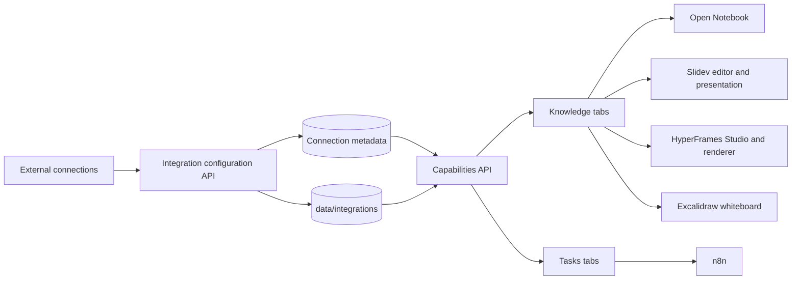
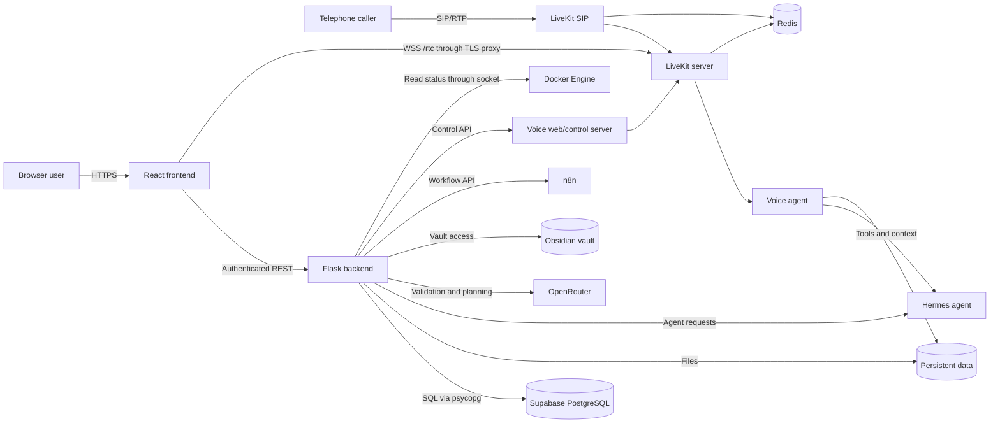
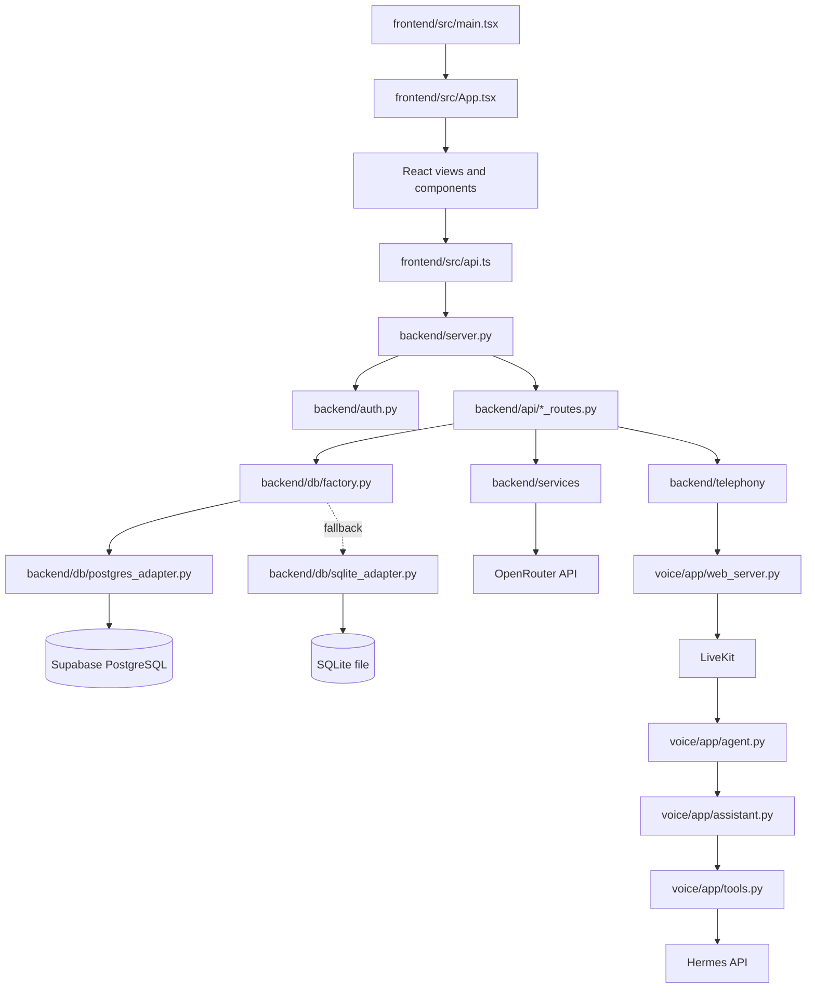

# OrganAIzer architecture

## External workspace capability flow



Secrets and Slidev projects live in the persistent `data/` mount.
`backend/integration_config.py` writes local configuration atomically with
owner-only permissions and removes secret values from API responses.

Slidev, HyperFrames and Excalidraw use the `workspace_auth_routes.py` ticket exchange:
the authenticated SPA requests a short-lived signed ticket, the external HTTPS
host exchanges it for an HttpOnly partitioned cookie, and Nginx `auth_request`
checks that cookie for HTML, assets, and WebSocket upgrades.

Slidev stores presentations below `data/slidev/projects/<project>/`. The backend
validates all project-relative paths and manages Markdown, folders, and media;
`.active-project` is an atomic pointer consumed by the Slidev container
entrypoint. Its lightweight supervisor restarts only the Slidev child process
when that pointer changes. Audience and presenter views share the same
authenticated reverse proxy, with presenter mode routed to
`/slidev/presenter/`. The API proxy permits request bodies up to 110 MB, while
the Slidev backend enforces a 100 MB per-file limit.

Excalidraw runs as an isolated official application container. The public
`excalidraw.ai-server.org` reverse proxy exchanges a short-lived OrganAIzer
ticket for a partitioned HttpOnly cookie and authorizes all subsequent assets
through Nginx `auth_request`. The knowledge view checks the backend health
bridge before embedding the canvas; drawings remain local-first in the browser
and portable through Excalidraw file exports.

## Open Notebook integration

```text
OrganAIzer browser
  └─ Wissen / Recherche-Notebooks
       └─ authenticated /api/open-notebook/*
            └─ Flask Open Notebook bridge
                 └─ private Docker network → Open Notebook REST API
                      ├─ SurrealDB → data/open-notebook/surreal
                      └─ source files → data/open-notebook/files
```

`WissenView.tsx` combines the fast Obsidian Markdown store with an entry point
for deeper source-grounded research. `open_notebook_routes.py` validates
OrganAIzer authentication, hides service credentials, normalizes failures, and
forwards the native notebook surface. The Open Notebook v1 release channel owns
multimodal ingestion, search, contextual chat, transformations, citations, and
audio generation. Its separate SurrealDB deliberately avoids coupling the
external application's schema to OrganAIzer's Supabase schema.

The full Next.js studio is served by the existing Nginx Proxy Manager at
`open-notebook.ai-server.org` and embedded in `WissenView.tsx`. The native
Flask bridge remains responsible for readiness and the compact notebook
overview, while the iframe intentionally delegates the complete and evolving
Open Notebook feature surface to the upstream application.

## Overview

OrganAIzer is a containerized personal-organization platform that combines a React web application, a Flask API, a Supabase PostgreSQL database, workflow and knowledge integrations, and a LiveKit-based telephone/web voice assistant. The Flask backend remains the security and business-logic boundary: browsers never connect directly to PostgreSQL, while PostgREST is bound to localhost for administrative use. Persistent application data is mounted from the host so rebuilding or uploading containers does not replace the database, telephone book, call history, configuration, or n8n state.

## Runtime architecture



### Request and data flow

1. Vite builds the React frontend, which is either served by Flask or uploaded as static files to the public web server.
2. The frontend authenticates through Flask against OpenWebUI and sends the returned bearer token with protected API requests.
3. Flask routes validate requests and delegate persistence to the database adapter selected by `DATABASE_URL`.
4. Production uses `PostgresAdapter` and the private `organaizer_backend` role; the SQLite adapter remains available as a local fallback and migration source.
5. Telephony routes control the separate voice services, while the voice agent uses LiveKit for audio and Hermes for calendar, email, and other agent capabilities.
6. Docker bind mounts retain Supabase, Redis, n8n, phonebook, call-history, and configuration data across image rebuilds.
7. The browser token endpoint replaces server-local LiveKit URLs with the external HTTPS API origin, producing a secure `wss://` signaling URL; SIP and agent services continue using their internal localhost URL.

## Module connections



The frontend is deliberately coupled only to HTTP contracts in `frontend/src/api.ts`; route modules contain application behavior, while database selection is centralized in `backend/db/factory.py`. This separation allows the same routes and import/export services to use Supabase or SQLite through `DatabaseInterface`. The voice stack is independently deployable but shares persisted telephone configuration and communicates with the main backend through its control API.

## Repository tree

Generated directories such as `frontend/dist`, `frontend/node_modules`, Python caches, Playwright reports, and runtime contents below `data`, `n8n_data`, and `persistent-backups` are intentionally summarized rather than expanded.

```text
OrganAizer3/
├── architecture.md                 # This architecture and repository overview.
├── README.md                       # Primary setup, operation, and user documentation.
├── Dockerfile                      # Builds the React bundle and Flask production image.
├── docker-compose.yml              # Defines the application, Supabase, external workspaces, and voice stack.
├── slidev/                          # Builds and supervises the multi-project Slidev presentation service.
├── hyperframes/                     # Builds the Node 22, Chromium, and FFmpeg renderer/studio service.
├── docker-entrypoint.sh            # Starts Flask and performs only the safe SQLite first-run import.
├── requirements.txt                # Declares Python dependencies for the main backend.
├── schedule.xlsx                   # Supplies the initial schedule for a new SQLite installation.
├── start.sh                        # Starts the project in its standard local mode.
├── update_all.sh                   # Updates and rebuilds the complete project.
├── upload_backend.sh               # Uploads code while protecting persistent server data and redeploys Docker.
├── upload_frontend.sh              # Builds and uploads the static frontend to the web host.
├── requirements.md                 # Records functional and technical project requirements.
├── implementation.md               # Documents implementation decisions and progress.
├── design.md                       # Describes visual and interaction design conventions.
├── bugreport.md                    # Collects known or previously investigated defects.
├── backend/
│   ├── __init__.py                 # Marks the backend as a Python package.
│   ├── server.py                   # Creates Flask, initializes infrastructure, registers routes, and serves the SPA.
│   ├── main.py                     # Provides command-line schedule import and export operations.
│   ├── config.py                   # Loads environment variables and resolves runtime paths and service settings.
│   ├── integration_config.py       # Persists and redacts local external-integration settings.
│   ├── workspace_tokens.py         # Signs and validates expiring iframe workspace grants.
│   ├── auth.py                     # Integrates OpenWebUI authentication and protects API requests.
│   ├── api/
│   │   ├── __init__.py             # Marks the API route collection as a package.
│   │   ├── routes.py               # Implements core schedule, media, Hermes, configuration, and task-history APIs.
│   │   ├── resources_routes.py     # Implements CRUD endpoints for people, roles, rooms, components, groups, and meetings.
│   │   ├── planning_routes.py      # Implements planning rules, jobs, dependencies, and AI-assisted planning.
│   │   ├── telephony_routes.py     # Exposes telephone configuration, phonebook, call history, and voice controls.
│   │   ├── obsidian_routes.py      # Provides authenticated and user-isolated Obsidian vault access.
│   │   ├── ai_connections_routes.py # Manages redacted AI-provider connection configurations.
│   │   ├── verbindungen_routes.py  # Manages general integration connection records.
│   │   ├── n8n_routes.py           # Manages n8n settings and workflow integration access.
│   │   ├── open_notebook_routes.py # Bridges authenticated Open Notebook requests.
│   │   ├── slidev_routes.py        # Loads and saves the persistent Slidev Markdown project.
│   │   ├── hyperframes_routes.py    # Exposes the authenticated renderer readiness check.
│   │   ├── excalidraw_routes.py     # Exposes the authenticated whiteboard readiness check.
│   │   ├── workspace_auth_routes.py # Exchanges SPA tickets for secure iframe cookies.
│   │   ├── access_requests_routes.py # Accepts rate-limited public access requests.
│   │   └── logging_middleware.py   # Records structured API request diagnostics.
│   ├── db/
│   │   ├── __init__.py             # Marks database infrastructure as a package.
│   │   ├── interface.py            # Defines the database operations required by routes and services.
│   │   ├── factory.py              # Chooses Supabase PostgreSQL or the SQLite fallback from configuration.
│   │   ├── postgres_adapter.py      # Translates application SQL and executes it transactionally through psycopg.
│   │   ├── sqlite_adapter.py        # Implements the same database contract for SQLite.
│   │   └── models.py               # Defines resource and assignment tables with dependency-safe clearing order.
│   ├── services/
│   │   ├── __init__.py             # Marks reusable backend services as a package.
│   │   ├── import_service.py        # Imports schedule workbook data into the selected database.
│   │   ├── export_service.py        # Exports database data and AI planning proposals to compatible Excel files.
│   │   └── openrouter_service.py    # Lists OpenRouter models and requests structured validation or planning results.
│   └── telephony/
│       ├── __init__.py              # Marks main-backend telephony helpers as a package.
│       ├── config_store.py          # Reads and safely persists telephone configuration.
│       ├── phonebook_store.py       # Reads, updates, and preserves telephone contacts and notes.
│       ├── call_log.py              # Manages persisted call summaries and dialogue history.
│       ├── livekit_token.py         # Produces LiveKit access tokens for web voice sessions.
│       ├── voice_client.py          # Calls the voice control service from Flask.
│       └── text_assistant.py        # Implements the web text-assistant bridge to Hermes and knowledge sources.
├── scripts/
│   ├── configure_supabase_access.py # Creates Supabase roles and least-privilege grants.
│   └── migrate_sqlite_to_supabase.py # Migrates and checksum-verifies every SQLite table in Supabase.
├── frontend/
│   ├── package.json                 # Defines frontend scripts, version, and JavaScript dependencies.
│   ├── package-lock.json            # Pins the exact frontend dependency graph.
│   ├── index.html                   # Provides the Vite application HTML shell.
│   ├── vite.config.ts               # Configures frontend builds and development behavior.
│   ├── tsconfig.json                # Configures browser-facing TypeScript compilation.
│   ├── tsconfig.node.json           # Configures TypeScript for Vite's Node-side files.
│   ├── playwright.config.ts         # Configures browser-based end-to-end tests.
│   ├── gen_icons.py                 # Generates the application's icon variants.
│   ├── src/
│   │   ├── main.tsx                 # Mounts React and global providers into the browser page.
│   │   ├── App.tsx                  # Owns authentication, navigation, and top-level view selection.
│   │   ├── api.ts                   # Centralizes typed HTTP calls and bearer-token handling.
│   │   ├── types.ts                 # Defines shared frontend domain types.
│   │   ├── i18n.ts                  # Supplies translations and language state.
│   │   ├── logging.ts               # Provides browser-side diagnostic logging.
│   │   ├── ThemeContext.tsx         # Provides persisted theme selection to React components.
│   │   ├── vite-env.d.ts            # Adds Vite environment typings to TypeScript.
│   │   ├── components/
│   │   │   ├── LandingPage.tsx      # Presents the public product landing page.
│   │   │   ├── LoginScreen.tsx      # Collects credentials and starts the authenticated session.
│   │   │   ├── Sidebar.tsx          # Renders primary navigation, user identity, and application version.
│   │   │   ├── AssistentView.tsx    # Provides the Hermes-backed text assistant interface.
│   │   │   ├── AufgabenView.tsx     # Provides research, OCR, YouTube, and task tools.
│   │   │   ├── TermineView.tsx      # Composes schedule filters, selector, calendar, and appointment details.
│   │   │   ├── WeeklyCalendar.tsx   # Visualizes appointments in a weekly calendar.
│   │   │   ├── WeekSelector.tsx     # Selects the displayed calendar week.
│   │   │   ├── FilterPanel.tsx      # Filters visible schedule entries.
│   │   │   ├── AppointmentDetail.tsx # Displays details for a selected appointment.
│   │   │   ├── RessourcenView.tsx   # Manages resources and drag-and-drop assignments for meetings and roles.
│   │   │   ├── PlanungView.tsx      # Manages rules and asynchronous AI planning jobs with progress polling.
│   │   │   ├── SystemView.tsx       # Monitors backend CPU, RAM, and Docker container states.
│   │   │   ├── TelefonieView.tsx    # Manages SIP settings, deletable calls, email-aware phonebook contacts, and the web telephone assistant.
│   │   │   ├── DialogView.tsx       # Provides the browser voice-dialog experience.
│   │   │   ├── SpracheView.tsx      # Provides text-to-speech, speech-to-text, and dictation tools.
│   │   │   ├── WissenView.tsx       # Provides Obsidian-backed knowledge management.
│   │   │   ├── BildGeneratorView.tsx # Provides AI image generation.
│   │   │   ├── KIVerbindungView.tsx # Manages AI-provider connections without exposing secrets.
│   │   │   ├── VerbindungenView.tsx # Manages general external-service connections.
│   │   │   ├── ConfigView.tsx       # Edits application configuration.
│   │   │   ├── ImportExport.tsx     # Starts Excel schedule import and export.
│   │   │   ├── LoggingPanel.tsx     # Displays and clears backend diagnostics.
│   │   │   ├── FeatureModal.tsx     # Presents details for a selected feature.
│   │   │   ├── InterestModal.tsx    # Collects public product-interest information.
│   │   │   ├── ProductPreview.tsx   # Displays visual previews on the landing page.
│   │   │   └── PlaceholderView.tsx  # Supplies a consistent placeholder for unfinished sections.
│   │   └── styles/
│   │       ├── app.css              # Defines global application and component styling.
│   │       ├── calendar.css         # Defines weekly-calendar layout and appointment styling.
│   │       └── filter.css           # Defines schedule-filter controls.
│   ├── public/                      # Contains public icons, logos, social previews, manifest, and robots metadata.
│   ├── logo-backup-original/        # Preserves the original branding assets before later revisions.
│   └── tests/
│       ├── global-setup.ts          # Prepares shared authentication state for browser tests.
│       ├── helpers.ts               # Provides reusable navigation, login, theme, and language test helpers.
│       ├── 01-landing-page.spec.ts  # Tests public landing-page content.
│       ├── 02-login.spec.ts         # Tests login, authenticated navigation, version, and logout.
│       ├── 03-zugang-anfragen.spec.ts # Tests public access-request submission.
│       ├── 04-theme.spec.ts         # Tests public theme switching.
│       ├── 05-language.spec.ts      # Tests public language switching.
│       ├── 06-aufgaben-recherche.spec.ts # Tests assistant research tasks.
│       ├── 07-aufgaben-ocr.spec.ts  # Tests OCR task behavior.
│       ├── 08-aufgaben-youtube.spec.ts # Tests YouTube task behavior.
│       ├── 09-aufgaben-bilder.spec.ts # Tests task-oriented image generation.
│       ├── 10-sprache-tts.spec.ts   # Tests text-to-speech.
│       ├── 11-sprache-stt.spec.ts   # Tests speech-to-text.
│       ├── 12-sprache-diktieren.spec.ts # Tests dictation behavior.
│       ├── 13-ocr-url.spec.ts       # Tests OCR from remote URLs.
│       ├── 14-theme-auth.spec.ts    # Tests theme handling after authentication.
│       ├── 15-language-auth.spec.ts # Tests language handling after authentication.
│       ├── 16-bilder-generate.spec.ts # Tests the dedicated image generator.
│       └── TEST-REPORT.md           # Summarizes browser-test results and coverage.
├── voice/
│   ├── Dockerfile                   # Builds the voice agent and its control/web server image.
│   ├── requirements.txt             # Declares Python dependencies for LiveKit and voice processing.
│   ├── livekit.yaml                 # Configures LiveKit networking, Redis, API keys, and media ports.
│   ├── sip.yaml                     # Configures the LiveKit SIP bridge and RTP behavior.
│   ├── app/
│   │   ├── __init__.py              # Marks the voice runtime as a Python package.
│   │   ├── agent.py                 # Starts the LiveKit worker and creates an assistant for each call.
│   │   ├── assistant.py             # Coordinates speech recognition, language model, tools, and speech output.
│   │   ├── instructions.py          # Builds call context including current date, time, weekday, and behavior rules.
│   │   ├── tools.py                 # Exposes Hermes, calendar, email, phonebook, and call-related agent tools.
│   │   ├── config.py                # Loads merged environment and persisted telephone configuration.
│   │   ├── setup_sip.py             # Creates or reuses the required inbound SIP trunk and dispatch rule.
│   │   ├── web_server.py            # Serves LiveKit tokens and the main-backend voice control API.
│   │   ├── phonebook.py             # Resolves callers and appends timestamped conversation notes.
│   │   ├── call_log.py              # Persists voice-call metadata, dialogue, and summaries.
│   │   ├── knowledge.py             # Retrieves contextual knowledge from files and Obsidian.
│   │   └── logging_config.py        # Configures concise voice-service logging.
│   └── web/
│       ├── index.html               # Provides the standalone voice-client HTML shell.
│       ├── app.js                   # Connects the standalone browser client to LiveKit.
│       └── styles.css               # Styles the standalone voice client.
├── tests/
│   ├── __init__.py                  # Marks backend tests as a package.
│   └── test_obsidian_routes.py      # Tests Obsidian route isolation and behavior.
├── docs/
│   └── opencode-*.md                # Preserves historical feature briefs and implementation tasks.
├── upload/
│   └── index.html                   # Provides a small static upload or deployment landing page.
├── data/                            # Stores protected runtime databases, phonebook, call logs, Redis, and Supabase files.
├── n8n_data/                        # Stores protected n8n workflows and credentials.
└── persistent-backups/              # Stores protected pre-deployment and migration backups.
```

## Deployment and persistence boundaries

| Concern | Runtime component | Persistence or access boundary |
|---|---|---|
| Web UI | Static host and Flask static server | Rebuilt from `frontend/src`; contains no database credentials |
| Business API | `OrganAIzer` Flask container | Authenticates users and owns all normal data access |
| Primary database | `organaizer-supabase-db` | `./data/supabase-db` survives uploads and container recreation |
| Database REST | `organaizer-supabase-rest` | Bound to `127.0.0.1`; anonymous table access is revoked |
| SQLite fallback | `data/terminlandschaft.db` | Retained as migration source and emergency rollback copy |
| Workflow automation | `n8n` | `./n8n_data` is excluded from uploads |
| Phonebook and calls | Main backend and voice containers | Shared files below `./data` are excluded from uploads |
| Voice coordination | LiveKit, SIP, Redis, voice agent | Browser signaling enters through the TLS `/rtc` proxy, while SIP and agent traffic remains internal; Redis AOF and shared configuration persist below `./data` |
| Knowledge | Flask and voice agent | Per-user access is enforced above the mounted Obsidian root |

## Extension guidelines

- Add new browser functionality as a focused view in `frontend/src/components` and expose its calls through `frontend/src/api.ts`.
- Add new HTTP behavior in a dedicated Flask blueprint when it forms a distinct domain; keep authentication at the blueprint boundary.
- Extend `DatabaseInterface` only when both PostgreSQL and SQLite genuinely require a new shared operation.
- Apply future schema changes through explicit migration scripts with CLI count/checksum verification before application deployment.
- Keep secrets in the protected target-system `.env`, never in Compose files, source code, frontend bundles, or documentation.
- Place all user-generated or operational state under an upload-excluded persistent directory.
